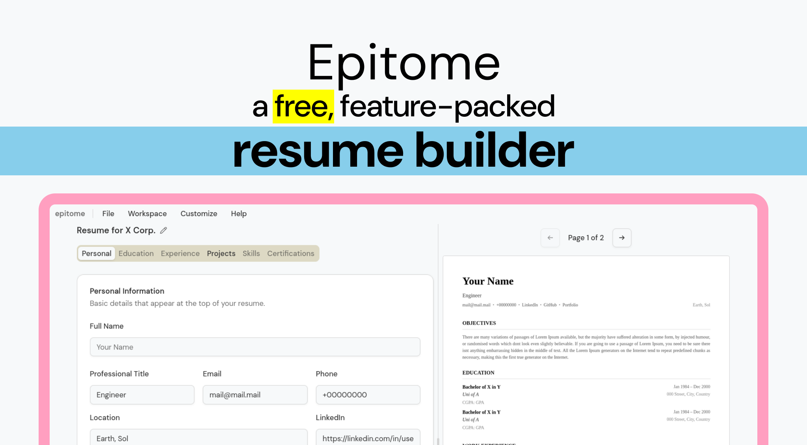

# Epitome




Epitome is a free, browser based, zero account resume generator.

It has many exciting features like:

- [Workspaces](https://doomkey.github.io/epitome/docs/workspaces)
- [Templates](https://doomkey.github.io/epitome/docs/customization/templates)
- Customize resume sections
- Local-only, there is no server. Eveything runs on browser
- Backup and restore data
- Open source.
- Everything is free.
- No ads.
- And much more.

Visit the [documentation](https://doomkey.github.io/epitome/docs) to know about all the features and usage.


## Features to Add

- [x] Paper size and margin
- [x] Settings
  - [x] New workspace: Copy/Start from fresh 
- [x] JSON export of a single workspace
- [x] Read-only link for sharing
- [x] Fallback preview on unsupported browsers
- [ ] Import from linkedin
- [ ] ~~Shortcuts~~
- [ ] ~~Inline rich text (bold-italics-underline)~~
- [ ] ~~Automatic page-break~~

## Supported Browsers

Due to the preview being rendered via canvas, any browser with non-presence of canvas/ blocked canvas, are not supported. 

### Not working

1. Via (Mobile)
2. Samsung Internet (Mobile)
3. UC Browser (Mobile): Preview works in generators, but not in shared page.
3. Duckduckgo (Mobile)

Any desktop browser, and mainstream mobile browsers are supported.

1. Firefox and its derivatives
  1. Zen
  2. Waterfox
  3. Librewolf (canvas enabled)
  4. etc.
2. Chromium and its derivatives
  1. Chrome
  2. Vivaldi
  3. Brave
  4. Opera
  5. etc.

Webkit-based browsers are not tested, but should work.  

## Running Locally

It is a SvelteKit project, so node and any package manager is required.

```bash
git clone https://github.com/doomkey/epitome.git
cd epitome
pnpm run dev
```

Locally, the project is managed via pnpm. However, npm, yarn etc. can also be used.


## Templates

The project uses pdfMake for pdf generation. Making a template is rather involving.

Lets call `src/lib` as `$lib` from now on.

At first inspect the pre-existing templates in the `$lib/templates` directory. The templates are named in ALLCAPS. Then begin creating your own template from the available functions. You can refer to the [pdfMake documentation](https://pdfmake.github.io/docs/0.3/).

Please note that you can use the `buildEntry()` function in the `$lib/templates/utils.ts` extensively for building section entries.

Suppose you've created a template which exports `myAwesomeTemplate`. To add the template to the template system in the UI, you have to open `$lib/functions/pdfGenerator.ts`.

At top, import your template.

```ts
// $lib/functions/pdfGenerator.ts
import { myAwesomeTemplate } from '$lib/templates/MYAWESOMETEMPLATE';

````

Then in some lines below, you will find `templates` constant. It is used to handle the template list in the customize menu. Add you template here.
Keep the value same as the key for consistency.

```ts
// $lib/functions/pdfGenerator.ts

export const templates = {
	DEFAULT: { name: 'Default', value: 'DEFAULT' },
	CLASSIC: { name: 'Classic', value: 'CLASSIC' },
	WATERFALL: { name: 'Waterfall', value: 'WATERFALL' },
	
	// ADD THE NEW TEMPLATE HERE  
	MYAWESOMETEMPLATE: {name:"My Awesome Temp", value:"MYAWESOMETEMPLATE"}
};

````

After that, register your template in the same file like so

```ts
registerTemplate(templates.MYAWESOMETEMPLATE.value, myAwesomeTemplate);
```

Start the server if not already running. Your template should show up in the template list.


## Contribution

You are welcome to contribute in any manner.
